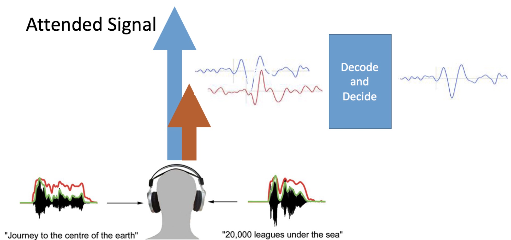

# The telluride_decoding Library

(This is not an official Google product!)

This repository contains Python/Tensorflow code to decode perceptual signals
from brain data.  The perceptual signals we are using are generally audio
features.  And the brain data is one of several types of signals, such as EEG,
MEG and ECoG. 

The Telluride Decoding Toolbox is geared towards large-scale decoding
experiments. You can
run small experiments in a colab. But this package keeps all the data in
files so the data doesn't have to fit into memory, and so it is easier to run
tens or hundreds of tests in parallel.

## License

This code uses the Apache License 2.0. See the LICENSE file for details.


## Purpose
This code builds and trains models that connect perceptual signals, primarily
audio, to brain signals, which can be EEG, MEG or ECOG. One common use for this
type of algorithm is to decode auditory attention, as shown in the figure below.



In attention decoding, we wish to know which of two (or more) signals a user is
attending. One signal (the upward pointing blue arrow) indicates that the signal
is being processed by the entire brain and is "exciting" all areas.  Another
signal is heard by the auditory system, but is not attended, and doesn't
recruit as much of the brain. The two signals are processed differently, and
produce different brain signals.

This software helps to decide which signal the user is attending, by building
a model that uses the EEG signal, for example, to predict the intensity of the
attended audio signal.

## Documentation
Documentation to follow (but there are extensive comments in the code.) The
three primary parts of this code are:

* ingest: Use to read various kinds of file formats and transform the data into
TFRecords for use by the decoding program
* decoding: Used to build, train and test models that connect audio and brain
signals.
* infer: Use to run a model on real or test data.  This model can run in real
time.

## To install
To install this software you can execute this command, which will automatically
install the necessary prerequisites:

```
pip install telluride-decoding
```

## Using this code
This library is written in Python3 and uses Tensorflow2. The
decoding code can be run as a standalone program, or as a library, in for
instance a [Colab](https://colab.research.google.com).

Documentation on the standalone decoding program can be found
[here](doc/decoding.md). This version is useful in distributed environments,
where one might want to do a parameter search.  Each run of the program
tests one set of parameters.

One can also use the program as a library in a Colab. Colab allows one to
interactively ingest data, build models, and test their performance. Here is
an example:

* Telluride4: Ingest and test linear regression.
[colab](https://colab.sandbox.google.com/github/google/telluride_decoding/blob/master/Telluride_Decoding_Toolbox_TF2_Demo.ipynb)


The code uses CPU or GPUs, as available. TPU support is forthcoming.

## References

James O'Sullivan, AJ Power, Nima Mesgarani, S. Rajaram, John Foxe,
Barbara Shinn-Cunningham, Malcolm Slaney, Shihab Shamma, Edward Lalor.
Attentional Selection in a Cocktail Party Environment Can Be Decoded from
Single-Trial EEG.
_Cereb Cortex_. 2015 Jul;25(7):1697-706.


Daniel D.E. Wong,  Søren A. Fuglsang,  Jens Hjortkjær, Enea Ceolini,
Malcolm Slaney, Alain de Cheveigné.
A Comparison of Temporal Response Function Estimation Methods for
Auditory Attention Decoding.
_Frontiers in Neuroscience_. doi: 10.3389/fnins.2018.00531.

This package contains Python and Tensorflow code for the Deep Canonical
Correlation Analysis algorithm. (An earlier MATLAB implementation can be
found at https://ttic.uchicago.edu/~wwang5/dccae.html)

Wang, Weiran and Arora, Raman and Livescu, Karen and Bilmes, Jeff.
On deep multi-view representation learning,
_International Conference on Machine Learning_, pp. 1083-1092,
2015.

Andrew, Galen and Arora, Raman and Bilmes, Jeff and Livescu, Karen.
Deep canonical correlation analysis.
_International conference on machine learning_, pp. 1247-1255,
2013. https://ttic.uchicago.edu/~klivescu/papers/andrew_icml2013.pdf

