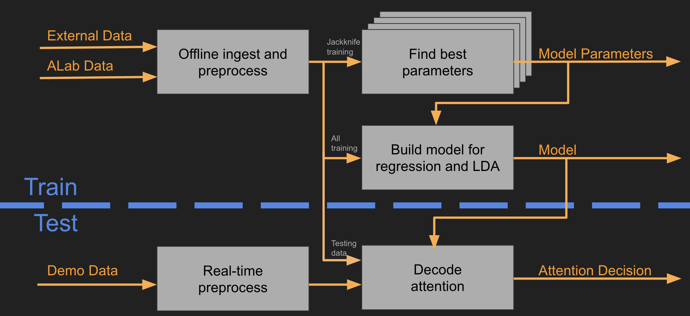
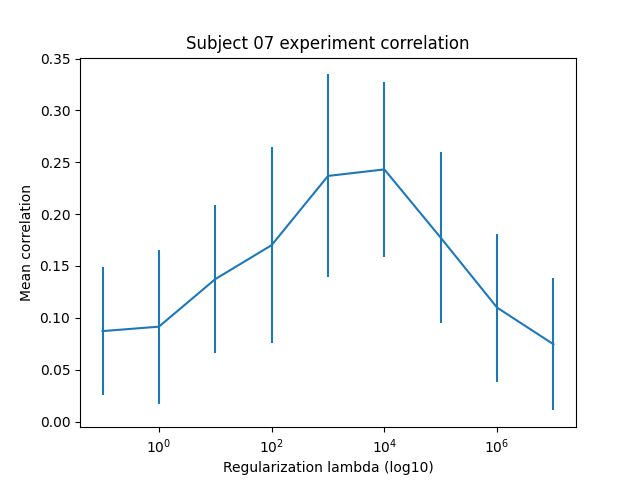
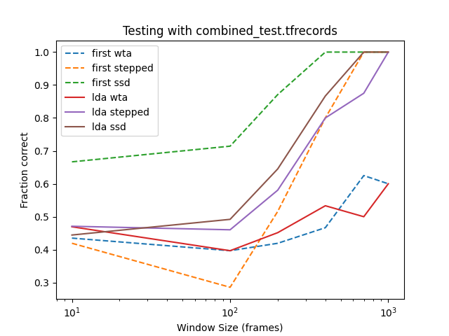
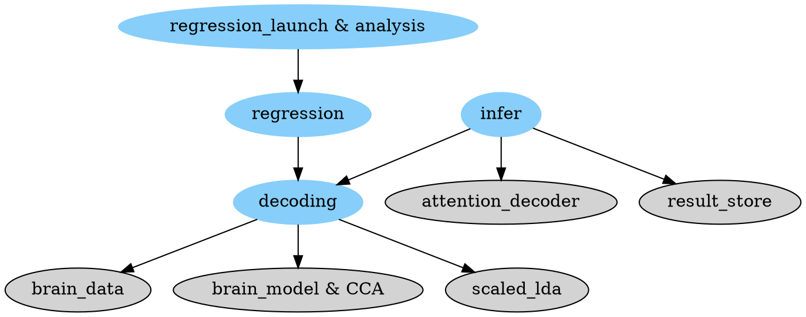

# Telluride Auditory Attention Decoding (AAD) Codelab

[TOC]

<!--*
# Document freshness: For more information, see go/fresh-source.
freshness: { owner: 'malcolmslaney' reviewed: '2021-03-18' }
*-->

## Introduction

This is a Codelab that documents how to setup and run Auditory Attention
Decoding (AAD) experiments using the Telluride Decoding codebase. 
The purpose of this Python/Tensorflow codebase is to build models that can 
decode attended audio
sources from brain recordings. Audio sources may consist of environmental
signals such as human speech, music and other ecologically-relevant sounds.
Neural data may consist of one of several types of brain recordings, such as
EEG, MEG or ECoG. The scientific basis for this AAD framework is first described
in this paper by
[O'Sullivan et al. (2015)](https://www.ncbi.nlm.nih.gov/pmc/articles/PMC4481604/).

The Telluride AAD pipeline involves the following 4 stages:

1.  Ingestion: preprocess raw data and convert to TFRecord format
1.  Modelling: model the attended audio signal in the brain (offline only)
1.  Decoding: use model to decode likelihood of attending to a speech sound
1.  Decision: Use the decoding output to decide the attention direction

This document briefly describes the data flow and organization, and then talks
about how to build decoding models in TensorFlow. Because the system is modular,
one can start running an experiment at any stage of the pipeline. Some of this
functionality is also demonstrated in this Colab:
[AAD Codelab in Colab](https://colab.sandbox.google.com/github/google/telluride_decoding/blob/master/Telluride_Decoding_Toolbox_TF2_Demo.ipynb).

---

---

## Data Organization

This toolkit primarily reads data from files.
The core machine-learning (ML) routines assume that the data has been ingested
into Tensorflow's TFRecord format.  In this format, all the measurements are
stored in a frame-by-frame basis, where each frame contains the audio as one
or more vector (intensity, spectrogram, phone labels) and separately the
brain-wave data (EEG, MEG, ECog).
Each frame contains all the data vectors, and there
are *frame_rate* frames per second.
AAD experiments can select any of the fields
when performing an experiment.
Thus EEG can be used to predict audio intensity.


### TFRecords

After ingestion, the preprocessed brain data are combined with the corresponding
processed audio features and stored as
[TFRecords](https://www.tensorflow.org/tutorials/load_data/tfrecord),
Tensorflow's native file format. Under TFRecords, there are separate datasets
for each set of electrodes and/or trials.

### Model data

The combined audio/brain data in the TFRecords can be used to train models of
auditory attention in TensorFlow using a number of modelling algorithms
described below. Model performance is assessed over a range of hyperparameters
on each trial via leave-one-out 
cross-validation/[jackknifing](https://en.wikipedia.org/wiki/Jackknife_resampling).
The model coefficients that
correspond to the set of optimal hyperparameters can then be stored in a file
for later processing.

---

## AAD Pipeline

As previously mentioned, the analysis pipeline consists of 3 stages including
ingestion, modelling and decoding. This section describes each of these stages
in detail and how to execute each of them from a command shell.

The overall software architecture looks like this:



### Stage 0: Setup {#Stage0}

You can install the toolkit Python3 library using the following command.
(Use virtualenv if you are so inclined.)

```shell
pip3 install telluride_decoding
```

The examples in this codelab all run from within one directory on your
Linux machine.  (With the exception of the toolkit you installed above, which
goes wherever Python installs modules.)
You will want to chdir to this (new) directory before you start.
After you complete this codelab you
will have the following subdirectories within your current folder.

- data_cache: Where the downloaded train/test files are stored.
- summaries: Where the experiment results and models are stored.
- telluride_deocoding: Where the source programs are installed from GitHub.
- tfrecords: Where the TFRecord files are stored, after ingestion from the
data_cache, and before processing by the decoding toolkit.

Separately, you will want to download and install the source files because
some of the programs must be run directly.

```shell
if [ ! -r telluride_decoding/.git ]
then
  echo Cloning repository...
  git clone https://github.com/google/telluride_decoding.git
else
  echo Updating repository
  (cd telluride_decoding; git fetch)
fi

TDT_BIN=telluride_decoding/telluride_decoding  # Also set below
```

#### Testing the Toolkit

There are extensive tests built into this toolkit. To test all the software you
need to install one data file that is too big to host on GitHub, and install the
bazel build (and test) software.

Download the Telluride2015-demo.mat file from
[this URL](https://drive.google.com/uc?id=0ByZjGXodIlspWmpBcUhvenVQa1k), and
install it as the file: telluride_decoding/test_data/telluride4/Telluride2015.mat

Then you can install bazel and run all the tests using these commands:

```shell
sudo apt-get install bazel
(cd telluride_decoding; bazel test --nocache_test_results :all)
```
which then produces this output:

```shell{.bad}
INFO: Build option --cache_test_results has changed, discarding analysis cache.
INFO: Analyzed 19 targets (0 packages loaded, 322 targets configured).
INFO: Found 1 target and 18 test targets...
INFO: Elapsed time: 61.819s, Critical Path: 61.61s
INFO: 18 processes: 18 linux-sandbox.
INFO: Build completed successfully, 19 total actions
//:attention_decoder_test                                                PASSED in 37.9s
//:brain_data_test                                                       PASSED in 14.0s
//:brain_model_test                                                      PASSED in 61.6s
//:cca_test                                                              PASSED in 7.6s
//:csv_util_test                                                         PASSED in 3.0s
//:decoding_test                                                         PASSED in 28.0s
//:infer_decoder_test                                                    PASSED in 30.7s
//:infer_test                                                            PASSED in 24.8s
//:ingest_brainvision_test                                               PASSED in 3.0s
//:ingest_test                                                           PASSED in 9.5s
//:plot_util_test                                                        PASSED in 2.9s
//:preprocess_audio_test                                                 PASSED in 0.5s
//:preprocess_test                                                       PASSED in 12.1s
//:regression_data_test                                                  PASSED in 49.7s
//:regression_test                                                       PASSED in 3.4s
//:result_store_test                                                     PASSED in 0.5s
//:scaled_lda_test                                                       PASSED in 6.5s
//:utils_test                                                            PASSED in 2.8s

Executed 18 out of 18 tests: 18 tests pass.
INFO: Build completed successfully, 19 total actions
```

### Stage 1: Ingestion {#Stage1}

Stage 1 of the AAD pipeline involves ingesting your data into TFRecord format.
When doing this there are a lot of steps that are custom to your setup and
include things like connecting the proper audio and brain-wave data files,
aligning them temporally, and picking out the proper signals.

For the purposes of this codelab, we use a published dataset from
this paper.
 
>Hjortkjær, J, Märcher-Rørsted, J, Fuglsang, SA, Dau, T (2018).
Cortical oscillations and entrainment in speech processing during working memory load.
*European Journal of Neuroscience.*
(doi:10.1111/ejn.13855)[https://doi.org/10.1111/ejn.13855]

In general, you will need to write Python code to call pieces of the ingest.py
source to convert your data into TFRecords.  See the documentation at the 
top of the telluride_decoding/telluride_decoding/ingest.py file for a simple
example.

In this case we have code, as part of the software regression tests, that
downloads several different datasets from the Internet so we can replicate
earlier results.  This is done by the regression_data program, which
downloads the data from the Internet and unpacks it into the data_cache
directory (a user settable choice). It then ingests the data creating the
TFRecord files needed for an experiment. 

```shell
python3 $TDT_BIN/regression_data.py --type jens_memory \
  --cache_dir data_cache/jens_memory \
  --tf_output_dir tfrecords/jens_memory
```
This command downloads 3.1Gbytes of data, and creates 22 subject directories,
each directory containing 40 trails for that subject.  A summary file 
(tfrecords/jens_memory/README.txt) is also created to describe the overall data.
Part of this summary is shown below.

```shell{.bad}
These files were ingested from: data_cache/jens_memory
Using: ['telluride_decoding/telluride_decoding/regression_data.py', '--type', 'jens_memory', '--cache_dir', 'data_cache/jens_memory', '--tf_output_dir', 'tfrecords/jens_memory']
With a output frame rate of 64Hz

Feature shapes are:
        intensity: FixedLenFeature(shape=[1], dtype=tf.float32, default_value=None)
        eeg: FixedLenFeature(shape=[69], dtype=tf.float32, default_value=None)

All ingested files:
        tfrecords/jens_memory/subject_01/trial_01.tfrecords: 3721 records (58.140625 seconds) 
        tfrecords/jens_memory/subject_01/trial_02.tfrecords: 3494 records (54.59375 seconds) 
        tfrecords/jens_memory/subject_01/trial_03.tfrecords: 3632 records (56.75 seconds) 
        tfrecords/jens_memory/subject_01/trial_04.tfrecords: 3050 records (47.65625 seconds) 
        tfrecords/jens_memory/subject_01/trial_05.tfrecords: 3340 records (52.1875 seconds) 
        tfrecords/jens_memory/subject_01/trial_06.tfrecords: 3652 records (57.0625 seconds) 
        tfrecords/jens_memory/subject_01/trial_07.tfrecords: 3342 records (52.21875 seconds) 
```

These datasets are currently included:

|  Name | Paper  | Data  | Description  |
|---|---|---|---|
|  telluride4 | [Github](https://github.com/neuromorphs-2017-decoding/telluride-decoding-toolbox)  | [GDrive](https://drive.google.com/uc?id=0ByZjGXodIlspWmpBcUhvenVQa1k)  | 4 simultaneous listeners, AV speech with a single speaker, 32 trials, 2 minutes each. |
| jens_memory  | [Hjortkjær, J, Märcher-Rørsted, J, Fuglsang, SA, Dau, T (2018)](https://doi.org/10.1111/ejn.13855) | [Zenodo](https://zenodo.org/record/1199011#.YS7fQtNKhLQ)  | 22 listeners, 2 speakers, 50 trials, each one minute long  |
| jens_impaired  | [Fuglsang, S A, Märcher-Rørsted, J, Dau, T, Hjortkjær, J (2020)] (https://www.jneurosci.org/content/40/12/2562)  | [Zenodo](https://zenodo.org/record/3618205/)  | 22 hearing impaired and 22 normal listeners, single and two speaker, 48 trials, about 400 seconds each  |
| KULeuven | [N. Das, T. Francart, and A. Bertrand (2020)](https://zenodo.org/record/3997352) | [Zenodo](https://zenodo.org/record/3997352)  | 16 normal listeners, listened to two simultaneous stories in Dutch  |
| To come...  |   |   |   |
|   | [ S. A. Fuglsang, D. D. E. Wong, and J. Hjortkjaer (2018)](https://zenodo.org/record/1199011)  | [Zenodo](https://zenodo.org/record/1199011)  | 18 subjects listening to one of two competing speech audio streams  |

### Stage 2: Modelling

The heart of the AAD pipeline is the machine learning that decodes the EEG
signals and connects them to the attended audio. Currently there are three types
of models:

*  Linear regression
*  Canonical correlation analysis (CCA)
*  Deep neural network (DNN)

At the simplest, an AAD decoding experiment is done using the
[decoding] (decoding.py)
program.
The overall decoding program and its options are described
[here](decoding.md).
The decoding program takes TFRecord files (produced by the ingestion
process above) and builds and tests a model.

#### Stage 2.1: Define the type of experiment {#Stage2.1}
The following shell variables define the type of model building to perform.
You can change these at will, as long as you use the same parameters for the
rest of the experiment.  (And you reload these parameters if you need to
restart/relogin to your shell.)

```shell
# Define the type of experiment
tfrecord_path='tfrecords/jens_memory'  # Always tfrecords now, relative to cwd
subj='subject_07'                      # A particularly good subject
method='cca'                           # cca or linear
exp_type='codelab'                     # Subdirectory for results.  OK to change
```

#### Stage 2.2: Defining all the file locations {#Stage2.2}
Use the following block of code to create the directory and file names, based
on the parameters above.  Note: if you change the parameters above, you need to
rerun this block.

```shell
# Where to find all the source code (and binaries)
TDT_BIN=telluride_decoding/telluride_decoding  # Set by git clone above.

# Where to find the raw data.
tf_data_dir="${tfrecord_path}/${subj}"

# Where to put the experiment summaries generated by the training phase.
sum_base_dir="summaries/${exp_type}"
sum_dir="${sum_base_dir}/${subj}_${method}"

# Where do we store the parameters for the best model?
param_file=${sum_dir}/model_params.txt

# Where to find the final model.
model_dir="${sum_dir}/model"
```

The python script below shows some of this data.

```shell
python3 <<!
import tensorflow as tf

raw_dataset = tf.data.TFRecordDataset("${tf_data_dir}/trial_01.tfrecords")

for raw_record in raw_dataset.take(1):
    example = tf.train.Example()
    example.ParseFromString(raw_record.numpy())
    print(example)
!
```
This produces this description of the first record in the file,
part of which is shown below:

```shell{.bad}
features {
  feature {
    key: "eeg"
    value {
      float_list {
        value: 3884.582275390625
        value: -2074.56298828125
        value: -973.3192749023438
        value: 1699.10791015625
        value: -3299.232177734375
        ...
        value: -9959.10546875
        value: -2618.705078125
        value: -5310.12744140625
        value: -2434.453857421875
      }
    }
  }
  feature {
    key: "intensity"
    value {
      float_list {
        value: -1.409355640411377
      }
    }
  }
}

```

#### Stage 2.3: Launching the train/test jobs {#Stage2.3}
The shell script below launches a large number of decoding jobs, each of which
trains a CCA model on all but one of the subject's files, and then tests on the
remaining files.  This is done for a number of regularization values, looking
for the peak that balances overtraining with test performance.
(In a proper pipeline, the regularization parameter should be computed with
a separate set of validation data, and then applied to the data.) 
The model is built using CCA to link the intensity and eeg fields from the
TFRecord data, and then measures performance with Pearson's correlation of
the first dimension of the CCA-rotated result vectors.

```shell
for trial in 01 02 03 04 05 06 07 08 09 10 11 12 13 14 15 16 17 18 19 20 21 22 23 24 25 26 27 28 29 30 31 32 33 34 35 36 37 38 39 40
do
  for lambda in 1e-1 1e0 1e1 1e2 1e3 1e4 1e5 1e6 1e7
  do
    test_file=trial_${trial}.tfrecords

    sum_dir_lambda=${sum_dir}/lambda_${lambda}_test_trial${trial}

    python3 $TDT_BIN/decoding.py --tfexample_dir $tf_data_dir \
        --dnn_regressor cca \
        --input_field eeg \
        --post_context 21 \
        --pre_context 15 \
        --output_field intensity \
        --input2_field intensity \
        --input2_pre_context 15 \
        --input2_post_context 15 \
        --regularization_lambda $lambda \
        --test_metric cca_pearson_correlation_first \
        --shuffle_buffer_size 0 \
        --cca_dimensions 5 \
        --summary_dir ${sum_dir_lambda} \
        --train_file_pattern allbut \
        --test_file_pattern $test_file \
        --validate_file_pattern $test_file &
  done
  wait
done
```

Note, for each test trial file, this shell script launches a decoding job
for all the regularization values in parallel. This is efficience 
since most CPUs are multi-core.  The shell script waits for all these jobs
to finish before launching the next test file.
This takes a while to run since it represents 40 different train/test trials
for 9 different regularization vaules.

The command below shows the directories created for one test file (trial07).

```shell
ls -d ${sum_dir}/*trial07
```

This should produce a list of directory names, each one representing one
jackknife test for test file 07, and keyed by regularization
value.
For example (depending on window width):

```none {.bad}
summaries/codelab/subject_07_cca/lambda_10_test_trial07
summaries/codelab/subject_07_cca/lambda_1e-1_test_trial07
summaries/codelab/subject_07_cca/lambda_1e2_test_trial07
summaries/codelab/subject_07_cca/lambda_1e3_test_trial07
summaries/codelab/subject_07_cca/lambda_1e4_test_trial07
summaries/codelab/subject_07_cca/lambda_1e5_test_trial07
summaries/codelab/subject_07_cca/lambda_1e6_test_trial07
summaries/codelab/subject_07_cca/lambda_1e7_test_trial07
summaries/codelab/subject_07_cca/lambda_1_test_trial07

```

Within each of these result directories, there is a results.txt file, which
contains a summary of that jackknife test.  For example this output (which is
too wide to see all at once, so scroll to the right):

```none {.bad}
Parameters: attended_field=;batch_norm=False;batch_size=512;cca_dimensions=5;check_file_pattern=;correlation_frames=100;correlation_reducer=lda;data=tfrecords;debug=False;dnn_regressor=cca;dropout=0.0;epoch_count=100;frame_rate=100.0;hidden_units=20-20;input2_field=intensity;input2_post_context=15;input2_pre_context=15;input_field=eeg;learning_rate=0.05;loss=mse;min_context=0;output_field=intensity;post_context=21;pre_context=15;random_mixup_batch=False;regularization_lambda=10.0;saved_model_dir=None;shuffle_buffer_size=0;summary_dir=/usr/local/google/home/malcolmslaney/Projects/telluride_codelab/summaries/codelab/subject_07_cca/lambda_10_test_trial07/;tensorboard_dir=None;test_file_pattern=trial_07.tfrecords;test_metric=cca_pearson_correlation_first;tfexample_dir=/usr/local/google/home/malcolmslaney/Projects/telluride_codelab/tfrecords/jens_memory/subject_07;tfexample_pattern=;train_file_pattern=allbut;validate_file_pattern=trial_07.tfrecords
Final_Testing/loss: 0.0605539
Final_Testing/cca_pearson_correlation_first: 0.0605539
Final_Testing/dprime: 1.45253
```

We analyze the results of the experiment above by 
organizing the summary files by regularization value
and then calculate the mean and standard deviation.  The following Python
program summarizes all the results and produces the plot shown below.

```shell
python3 <<!
from collections import defaultdict
import os
import re

from absl import app
from absl import flags

import numpy as np
import tensorflow as tf

import matplotlib
matplotlib.use('Agg')
import matplotlib.pyplot as plt  # pylint: disable=g-import-not-at-top

flags.DEFINE_string('subject', '07', 'Subject number for plotting results.')
flags.DEFINE_string('method', 'cca', 'Regression method used for analysis.')
flags.DEFINE_string('plot_file', 'exp_summary.png', 'File name for output plot.')

FLAGS = flags.FLAGS


def main(argv):
  if len(argv) > 1:
    raise app.UsageError('Too many command-line arguments: %s.', argv)

  base_dir = '/usr/local/google/home/malcolmslaney/Projects/telluride_codelab'
  sum_dir = os.path.join(base_dir, 'summaries', 'codelab', 'subject_%s_%s' %
                         (FLAGS.subject, FLAGS.method))

  result_dict = defaultdict(lambda: [])
  dirs = tf.io.gfile.glob(os.path.join(sum_dir, 'lambda*test*'))
  param_decoder = re.compile('lambda_(.*)_test_(.*)')

  if not dirs:
    raise ValueError('Could not find any results in %s' % sum_dir)

  for dir_name in dirs:
    m = param_decoder.search(dir_name)
    if not m:
      print('Could not parse this directory name:', dir_name)
      continue
    (reg_lambda, test_file) = m.groups()
    with tf.io.gfile.GFile(dir_name + '/results.txt') as result_fp:
      for line in result_fp:
        if line.startswith('Final_Testing/cca_pearson_correlation_first'):
          new_result = float(line.split(':')[1])
          result_dict[float(reg_lambda)].append(new_result)

  reg_lambdas = sorted(result_dict.keys())
  means = []
  stds = []
  for l in reg_lambdas:
    means.append(np.mean(result_dict[l]))
    stds.append(np.std(result_dict[l]))

  plt.errorbar(reg_lambdas, means, stds)
  plt.xscale('log')
  plt.xlabel('Regularization lambda (log10)')
  plt.ylabel('Mean correlation')
  plt.title('Subject ' + FLAGS.subject + ' experiment correlation')

  if FLAGS.plot_file:
    print('Writing summary plot to', FLAGS.plot_file)
    with tf.io.gfile.GFile(FLAGS.plot_file, 'wb') as FLAGS.plot_file:
      plt.savefig(FLAGS.plot_file, format='png')


if __name__ == '__main__':
  app.run(main)
!
```

This results in the following summary plot, showing a clear peak in test 
performance for a regularization value of 1000.
(Not this value depends on both the algorithm used to compute the model, and 
the absolute scaling of the input data.)



---

### Stage 3: Decoding Analysis and Model Building {#Stage3}
There are two parts to building a model: picking the best parameters, and then
reading all the data and creating the new model.  They are described below.

#### Stage 3.1: Find the best parameters {#Stage3.1}

In this simple example above, with only one meta parameter, we can select
the best value (1e3 or 1e4) from the graph above.

In a more complicated experiment that explores a number of meta parameters
(such as the lag window) you might need to write a program to select
the best performing model.  But in this case we have a fixed solution.

The following bit of code extracts the parameters for the best regularization
value from one of the winning result files, and puts the parameters in the
right format to describe the best model.  These parameters will then be passed
to a new decoding program that builds a new model using all the training data.
(This might be used to then run inference on new data.)

```shell
python3 <<!
import os

best_regularization = '1e3'  # Must be a string

subj='subject_07'            # A particularly good subjec
method='cca'                 # cca or linear
exp_type='codelab'           # Subdirectory for results.  To agree with above.

# Where to put the experiment summaries generated by the training phase.
sum_base_dir = os.path.join('summaries', exp_type)
sum_dir = os.path.join(sum_base_dir, f'{subj}_{method}')

parameter_line = 'Parameters: '
with open(os.path.join(sum_dir, f'lambda_{best_regularization}_test_trial01',
                       'results.txt')) as fp:
  for line in fp:
    if line.startswith(parameter_line):
      parameters = line[len(parameter_line):].split(';')
      break

param_file = os.path.join(sum_dir, 'model_params.txt')
with open(param_file, 'w') as fp:
  fp.write('\n'.join(['--' + val for val in parameters]))
print('Wrote model file to', param_file)
!

```

More importantly, the command above creates a parameter file, 
summaries/codelab/subject_07_cca/model_params.txt,
with the best regularization value. 

```shell{.bad}
--attended_field=
--batch_norm=False
--batch_size=512
--cca_dimensions=5
--check_file_pattern=
--correlation_frames=100
--correlation_reducer=lda
--data=tfrecords
--debug=False
--dnn_regressor=cca
--dropout=0.0
--epoch_count=100
--frame_rate=100.0
--hidden_units=20-20
--input2_field=intensity
--input2_post_context=15
--input2_pre_context=15
--input_field=eeg
--learning_rate=0.05
--loss=mse
--min_context=0
--output_field=intensity
--post_context=21
--pre_context=15
--random_mixup_batch=False
--regularization_lambda=1000.0
--saved_model_dir=None
--shuffle_buffer_size=0
--summary_dir=summaries/codelab/subject_07_cca/lambda_1e3_test_trial01/
--tensorboard_dir=None
--test_file_pattern=trial_01.tfrecords
--test_metric=cca_pearson_correlation_first
--tfexample_dir=tfrecords/jens_memory/subject_07
--tfexample_pattern=
--train_file_pattern=allbut
--validate_file_pattern=trial_01.tfrecords
```

This becomes a flag file used below to create the final decoding model.

#### Stage 3.2: Building the final model {#Stage3.2}

Creating a new model is done with the
decoding program, which in this case builds and tests the model using *all* the
data.

```shell
# Where to find the experiment summaries generated by the training phase.
subj="subject_07"
method="cca"
exp_type="codelab"
sum_base_dir="summaries/${exp_type}"
sum_dir="${sum_base_dir}/${subj}_${method}"

param_file="${sum_dir}/model_params.txt"
model_dir="${sum_dir}/model"

python3 ${TDT_BIN}/decoding.py \
            --flagfile ${param_file} \
            --tfexample_dir "${tf_data_dir}" \
            --train_file_pattern "" \
            --test_file_pattern "" \
            --validate_file_pattern "" \
            --saved_model_dir "${model_dir}"
```

The new *saved_model_dir* parameter specifies that a model should be built.
The best regularization result is used as the regularization value,
and a new model is trained on *all* the training data.
Building a model takes a long time (~1 hour on my workstation).

This output of this command is the model stored in the *saved_model_dir*
that is used for real-time processing as well as
the decision/inference stage.

In addition there is another
measure of train performance
(which is empty because the linear and CCA regressors do not
learn like a DNN, instead computing the optimum model directly)
and test perforamance, as shown below, for double
checking against the average performance found by the jackknife
process above.  (To see just these results redirect standard output by
appending "> /tmp/results.txt" to the end of the python3 command.  After it
finishes "cat /tmp/results.txt".)

```shell{.bad}
270/270 [==============================] - 1s 5ms/step - loss: 0.2055 - cca_pearson_correlation_first: 0.1702

Model: "brain_model_cca"
_________________________________________________________________
Layer (type)                 Output Shape              Param #   
=================================================================
brain_cca_layer (BrainCcaLay multiple                  15504     
=================================================================
Total params: 15,504
Trainable params: 0
Non-trainable params: 15,504
_________________________________________________________________
final_shuffle_and_batch: Mixing up the batches of data for testing!!!!
Creating a CCA decoding model....
in Fit: eigen_pairs are: [(0.0, array([-0.89604307,  0.06010842,  0.27104165,  0.26809871,  0.21943861])), (0.6184223191102625, array([ 0.03088706, -0.13532475, -0.61020807, -0.6035825 , -0.49403186])), (4.529523331907541e-17, array([-0.01505856,  0.07445721,  0.62971437, -0.77130962,  0.05263691])), (1.3389797314410318e-17, array([ 0.20938621, -0.72413242,  0.55212744,  0.33452282, -0.12263534])), (3.919424657760565e-17, array([ 0.04761232, -0.06956744, -0.25495127, -0.26433566,  0.92629366]))]
train_and_test got these results: {} and test {'loss': 0.20550338923931122, 'cca_pearson_correlation_first': 0.17020219564437866}
Calculated dprime is 1.5728.
Wrote train/test results to summaries/codelab/subject_07_cca/lambda_1e3_test_trial01/.
Wrote saved model to summaries/codelab/subject_07_cca/model.
```

This stage produces a model that is used for real-time processing as well as
the decision/inference stage.  See this model using this command:

```shell
ls -ls ${model_dir}
```
which lists these files:

```shell {.bad}
total 52
 4 drwxr-x--- 2 malcolmslaney primarygroup  4096 Sep 18 21:59 assets
 4 -rw-r----- 1 malcolmslaney primarygroup  1408 Sep 21 18:19 decoder_model.json
40 -rw-r----- 1 malcolmslaney primarygroup 39632 Sep 21 18:19 saved_model.pb
 4 drwxr-x--- 2 malcolmslaney primarygroup  4096 Sep 21 18:19 variables

```

To see what data this model wants,
execute this command to see the model signature.  (The saved_model_cli
command is part of the Tensorflow installation.)

```shell
saved_model_cli show --dir ${model_dir} --tag_set serve --signature_def serving_default
```
This model has the following data requirements:

```shell {.bad}
The given SavedModel SignatureDef contains the following input(s):
  inputs['attended_speaker'] tensor_info:
      dtype: DT_FLOAT
      shape: (-1, 1)
      name: serving_default_attended_speaker:0
  inputs['input_1'] tensor_info:
      dtype: DT_FLOAT
      shape: (-1, 2553)
      name: serving_default_input_1:0
  inputs['input_2'] tensor_info:
      dtype: DT_FLOAT
      shape: (-1, 31)
      name: serving_default_input_2:0
The given SavedModel SignatureDef contains the following output(s):
  outputs['output_1'] tensor_info:
      dtype: DT_FLOAT
      shape: (-1, 10)
      name: StatefulPartitionedCall:0
Method name is: tensorflow/serving/predict
```

### Stage 4: Decision/Inference {#Stage4}
Based on the results of the *decoding* stage, the *deciding* stage picks
the more likely source of the attended audio.
This is done with the infer program in one of three ways:

*  Maximum of correlation over each correlation window (WTA)
*  [State space decoder] (https://www.frontiersin.org/articles/10.3389/fnins.2018.00262/full) (SSD)
*  [Stepped decoder] (https://ieeexplore.ieee.org/document/8895794) -
Geirnaert calls this an Adpative Gain Control System.

The final infer program depends on data that has been recorded with one subject 
listening to two different speakers.  We do not have that with Jens' data
so we can use the following Python program to merge two recordings into one,
with the subject arbitrarily switching attention half way through.

```shell
python3 <<!
import os
import numpy as np
import matplotlib.pyplot as plt
import tensorflow as tf
tf.compat.v1.enable_v2_behavior()

from absl import app
from absl import flags

from telluride_decoding import brain_data
from telluride_decoding import ingest

flags.DEFINE_string('base_dir', 'tfrecords/jens_memory/subject_07', 
                    'Where to find the base set of TFRecords.')
flags.DEFINE_string('file1', 'trial_01.tfrecords', 'First data file to read.')
flags.DEFINE_string('file2', 'trial_02.tfrecords', 'Second data file to read.')
flags.DEFINE_string('output_file', 'tfrecords/jens_memory/test', 
                    'Where to store the combined test file.')

FLAGS = flags.FLAGS

def read_all_tfrecords(filename):
  """Reads all the data in a TFRecord file into a dictionary of nparrays.
  """
  record_count, _ = brain_data.count_tfrecords(filename)
  feature_dict = brain_data.discover_feature_shapes(filename)
  all_data = {}
  for k, description in feature_dict.items():
    all_data[k] = np.zeros((record_count, description.shape[0]), np.float32)

  dataset = tf.data.TFRecordDataset(filename)

  for i, a_record in enumerate(dataset):
    an_example = tf.train.Example.FromString(a_record.numpy())
    for k in an_example.features.feature.keys():
      feature_list = an_example.features.feature[k]
      all_data[k][i, :] = feature_list.float_list.value  # Assumes all floats

  return all_data

def main(argv):
  if len(argv) > 1:
    raise app.UsageError('Too many command-line arguments: %s.', argv)

  data1 = read_all_tfrecords(os.path.join(FLAGS.base_dir, 
                                          FLAGS.file1))
  data2 = read_all_tfrecords(os.path.join(FLAGS.base_dir, 
                                          FLAGS.file2))

  num_frames = min(data1['eeg'].shape[0], data2['eeg'].shape[0])
   
  # Create switched EEG signal where first half comes from file1 and second
  # half comes from file2.
  switched_eeg = np.concatenate((data1['eeg'][:num_frames//2, :],
                                 data2['eeg'][num_frames//2:num_frames, :]),
                                axis=0),
  # Likewise create ground truth showing attention signal flips half way through
  switched_attention = np.concatenate((np.zeros((num_frames//2, 1),
                                                dtype=np.float32),
                                       np.ones((num_frames//2, 1), 
                                               dtype=np.float32)),
                                      axis=0)
  new_data = {'intensity': data1['intensity'][:num_frames, :],
              'intensity2': data2['intensity'][:num_frames, :],
              'eeg': switched_eeg,
              'attended_speaker': switched_attention
             }

  # Create the experiment description so we can write out the data.
  trial_dict = {'combined_test': [{}, ]}

  experiment = ingest.BrainExperiment(trial_dict, '/tmp', '/tmp')
  experiment.load_all_data('/tmp', '/tmp')

  for k in new_data.keys():
    experiment.trial_data('combined_test').add_model_feature(k, new_data[k])

  print(experiment.summary())

  experiment.write_all_data(FLAGS.output_file)

  new_count, _ = brain_data.count_tfrecords('tfrecords/jens_memory/combined_test.tfrecords')
  new_features = brain_data.discover_feature_shapes('tfrecords/jens_memory/combined_test.tfrecords')
  print(f'Summarizing {FLAGS.output_file}: Found {new_count} records with',
        f'shape {new_features}') 
                            
if __name__ == '__main__':
  app.run(main)
!
```

The following program then analyzes the results. Note, this is not a good 
test for attention decoding because the data is very artificial.  
1) The EEG data is switched immediately between that due to one speaker and
the other.  This introduces a large discontinity which is an obvious artifact.
2) The subject is only hearing one audio at a time, not two as in the normal
attention switching paradigm.  Still this is a good way to show how
the software is used to decode attention.

```shell
python3 ${TDT_BIN}/infer.py \
  --plot_dir=$sum_dir \
  --model_dir=${sum_dir}/model \
  --tf_dir="tfrecords/jens_memory/test" \
  --infer_test_file="combined_test.tfrecords" \
  --audio_label 'intensity' \
  --comparison_test

echo "Window_test summary plot is in:" "${sum_dir}/test_results-comparison.png"
```

This produces a summary plot showing the relative performance of the two
(current) means of deciding the attended speaker: correlation winner and
state-space decoding.




## Software Overview
This figure gives a rough roadmap for the decoding software.  The light-blue
ellipses are main programs, and thus the starting point
for an experiment.
The gray ellipses are internal library routines (which are
accessible from Python or a Colab.)



Here are more details about what each source file (.py) does:

*   [attention_decoder](https://source.corp.google.com/piper///depot/google3/third_party/py/telluride_decoding/attention_decoder_test.py):
    Provides classes to enapsulate the final decision stage of our AAD
    processing: winner take all (WTA), stepped decoder, and the state-space
    decoder.
*   [brain_data](https://source.corp.google.com/piper///depot/google3/third_party/py/telluride_decoding/brain_data.py):
    Reads each type of data file into a tf.dataset object, adds temporal
    context, and then outputs a stream of TF records for analysis by TF models.
*   [brain_model](https://source.corp.google.com/piper///depot/google3/third_party/py/telluride_decoding/brain_model.py):
    Defines the models (all extensions of tf.keras.model). This class implements
    the linear and DNN regressors. CCA is a similar kind of model, but defined
    in its own file.
*   [cca](https://source.corp.google.com/piper///depot/google3/third_party/py/telluride_decoding/cca.py):
    Canonical correlation analysis (CCA) implements a dual regression model,
    rotating both the EEG and the audio data into spaces that maximize their
    correlation. (Linear regression is a subset of CCA.)
*   [decoding](https://source.corp.google.com/piper///depot/google3/third_party/py/telluride_decoding/decoding.py):
    A main program that collects the parameters, creates the necessary
    brain_data, feeds it to the brain_model, and collects results. It gives both
    training and testing results. It is also used, after running the
    regression_launch & analysis job, to build the final model. It uses the
    scaled_lda code to create the final LDA model.
*   [infer](https://source.corp.google.com/piper///depot/google3/third_party/py/telluride_decoding/infer.py):
    A program that handles all the final stage of AAD inference. It loads a
    predefined model, and calls the attention_decoder routine to make a decision
    about which source is being attended. This implements the WTA, stepped and
    SSD decisions.
*   [regression](https://source.corp.google.com/piper///depot/google3/third_party/py/telluride_decoding/regression.py):
    Runs one part of leave-one-out test of the AAD decoder. This calls the
    decoding routine to do the real work, to train on all but the test trial and
    testing performance with the trest file. This program is also used as a
    software regression test, running periodically to make sure our results on
    external datasets have not changed.
*   [regression_launch](https://source.corp.google.com/piper///depot/google3/googlex/refinery/heimdallr/aad_decoding/regression_xmanager/regression_launch.py)
    &
    [regression_analysis](https://source.corp.google.com/piper///depot/google3/googlex/refinery/heimdallr/aad_decoding/regression_xmanager/regression_analysis.py):
    This describe the
    [XManager](https://g3doc.corp.google.com/learning/deepmind/xmanager/g3doc/index.md?cl=head/xmanager)
    job that launches a hyperparameter search, over the outer product of defined
    parameters, and for all test files in a leave-one-out paradigm. Each job
    that is launched is one decoding job. The analysis routine then find the
    best set of parameters. These are stored as a "model," which is then read in
    as a flagfile in later runs of the decoding program.
*   [result_store](https://source.corp.google.com/piper///depot/google3/third_party/py/telluride_decoding/result_store.py):
    A set of routines that make it easy to buffer data streams (results) which
    have different block sizes (like the input batches, and the correlation
    windows.)
*   [scaled_lda](https://source.corp.google.com/piper///depot/google3/third_party/py/telluride_decoding/attention_decoder_test.py):
    Implements the linear-discriminant analysis (LDA) that we use to convert the
    multidimensional data that comes out of CCA into a scalar decision.

Not shown above are the
[preprocess](https://source.corp.google.com/piper///depot/google3/third_party/py/telluride_decoding/preprocess.py)
and
[ingest](https://source.corp.google.com/piper///depot/google3/third_party/py/telluride_decoding/ingest.py)
routines that put the raw EEG data into .tfrecord format.


