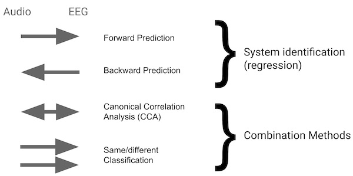

# telluride_decoding Library - decoding.py
This program is used to build, train, and test decoding models. It usually takes as
input a TFRecord file that contains perceptual (audio) features and
brain signals (EEG, MEG, or ECoG).  

There are two common cases: forward and backward.
In the forward case the decoder uses the audio
features to predict the brain signals, 
and in the backward case the decoder predicts the
audio features from the brain signals. These path are shown in the figure below.

The decoding software itself is agnostic
about the type of signal it is processing.
It only requires that you have one or more audio
features that match at each time step with one or more brain
signals.
(Generally, the sample rate is anywhere between 64 and 1024Hz.) 
In a common case, the EEG signals are used to predict the audio intensity.
The decoding software handles on the fly adding temporal context
to create a better model.
(I.e. the  EEG at time T is due to audio reaching the brain from T-Td to T.)

Generally the recording is done with multiple kinds of audio features
(intensity, spectrogram, etc.) and multiple kinds of brain data (different
channel configurations, etc.) Any number of data types can be used as input
to predict any other channel. In the usual EEG backward model, a set of EEG
channels (a multi-dimensional vector over time) is used as input, along with
some post context, to predict the audio intensity right now.

---
# Flags

### General experimental parameters
data - What type of data to read.  Deprecated.  The only supported format right
now is tfrecords.

pre_context - Number of frames of context to add to the input data _before_ 
the prediction. Defaults to 0.

post_context - Number of frames of context to add to the input data _after_
the  prediction. Defaults to 0.

min_context - Minimum number of frames of context for prediction.  If used, this
adjust the pre or post context (which ever is not specified) so the total context
has this number of frames.  Useful to automatically adjust parameters to keep the
total number of frames constant.  Defaults to 0.

input_field - Input field to use for predictions.  Must be one of the record types
in the TFRecord input file.  Defaults to 'eeg'

output_field -  Outpout field to use for predictions.  Must be one of the record types
in the TFRecord input file.  Defaults to 'intensity'

train_file_pattern - Which files to use for training, a regular expression.
Within the directory specified by the tfexample_dir, use the files that satisfy
this regular expression as training files.

test_file_pattern - Which files to use for testing, a regular expression.
Within the directory specified by the tfexample_dir, use the files that satisfy
this regular expression as testing files.

validate_file_pattern - Which files to use for validation, a regular expression.
Within the directory specified by the tfexample_dir, use the files that satisfy
this regular expression as validation files.  (Not currently used in the decoding
software).

check_file_pattern - Which files to use for checking the validity of the input
files, a regular expression.
Within the directory specified by the tfexample_dir, check the files that satisfy
this regular expression to see if they are valid TFRecord files.

tfexample_dir - Location of the data to be used for training, validation and
testing.  Must be in TFRecord format, with fields that correspond to the 
input and output field parameters.

random_mixup_batch - A boolean flag that indicates if we should mixup the data,
so labels are random. This is important for testing, to test the null hypothesis.
Defaults to False.

input_gain - Multiply the input by this gain factor. Useful to make sure that
input level does or doesn't matter.  Default is 1.0

### Network parameters
The following parameters control the type of network used in the predictions.

dnn_regressor - One of the following strings, which determine the architecture
to use when building a regressor:

* fullyconnected - A fully connected deep neural network, which tells the
decoder to use a fully connected 
network with the hidden units as specified by the hidden_units flag. 
Defaults to fullyconnected, 
* tf - Use the tf.estimator.DNNRegressor to build a regressor.
[Still need to understand why this is better/worse than the 
hand-coded fullyconnected network above.]
* linear -  A linear regressor, with the parameters design using Shrinkage,and
and a regularization lambda as described below.
* linear_with_bias - Like linear, but including an additive bias term

hidden_units - A hyphen separated list of integers, each
number indicating the number of hidden units at this stage 
in the DNN.

dropout - The [dropout](http://jmlr.org/papers/volume15/srivastava14a/srivastava14a.pdf)
rate, between 0 and 1 when training the model.  A dropout of 
0.1 means that 10% of the input units would be dropped in each
mini batch. The default value is 0.0, which means do not use dropout at all.

regularization_lambda - Regularization parameter for the linear regression.
The linear decoder uses shrinkage, and this parameter defines the 
amount to reduce the diagonal.  Default is 1.0. See section 2.1.4 of
[Wong's 2018](https://www.frontiersin.org/articles/10.3389/fnins.2018.00531/full)
paper for definitions
[Lambda here corresponds to the shrinkage parameter gamma
in Blankertz et al. NeuroImage 58 (2011) 814-825,
specificially used in Eq 13.]

learning_rate - The initial learning rate used by the ADAM
optimizer. Default value is 0.05.

loss - How to measure loss when optimizing the DNNs.  Choices are

* mse - Mean-squared prediction error. Default value.
* pearson - Pearson correlation between the label and the prediction. [Note, should be close to MSE since the inputs are
nearly normalized.]

context_method - Switch to control temporal window approach.
Deprecated, thus the default is 'new'

batch_norm - Switch to enable 
[batch normalization] (https://arxiv.org/pdf/1502.03167v3.pdf) 
at each stage of the DNN.  Default is False 
(but this is a good thing and should be used.)

### Basic experiment parameters
steps - Number of training steps.  Default value is 40000.

batch_size - Number of frames (with context) to use per batch.
Larger batches give better derivatives, but take longer.  Default
is 512,

decoder_model_dir - Location to save the Tensorflow models
and checkpoints. Default is /tmp/tf.

prefetch_buffer_size - Number of Dataset elements to 
[prefetch.](https://www.tensorflow.org/guide/performance/datasets#map_and_interleave_prefetch_shuffle)
Default is 100.

shuffle_buffer_size - Number of dataset elements to 
[shuffle.](https://www.tensorflow.org/guide/performance/datasets#map_and_interleave_prefetch_shuffle)
This should be much larger than the temporal correlation across
samples so that we get the most variability in each batch.
Default is 10000.

run - A dummy variable used to ensure duplicate jobs can be run,
allowing us to measure the run-by-run variability. [Otherwise, the
Tensorflow runtime system might use ap precomputed checkpoint, 
and not run a new job.]

saved_model_dir - A directory in which to save the model.  No model is saved
if this parameter is not set.

# References
The linear regression models used in this code are documented in a number of
papers, including these:

James O'Sullivan, AJ Power, Nima Mesgarani, S. Rajaram, John Foxe,
Barbara Shinn-Cunningham, Malcolm Slaney, Shihab Shamma, Edward Lalor.
Attentional Selection in a Cocktail Party Environment Can Be Decoded from
Single-Trial EEG.
_Cereb Cortex_. 2015 Jul;25(7):1697-706.

Daniel D.E. Wong,  Søren A. Fuglsang,  Jens Hjortkjær, Enea Ceolini,
Malcolm Slaney, Alain de Cheveigné.
A Comparison of Temporal Response Function Estimation Methods for
Auditory Attention Decoding.
_Frontiers in Neuroscience_. doi: 10.3389/fnins.2018.00531.
